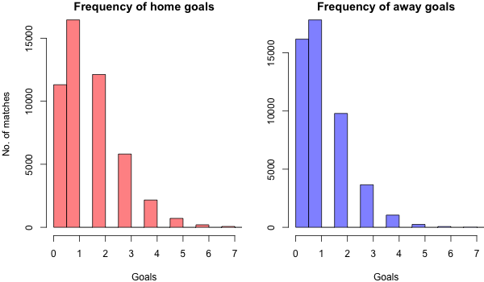
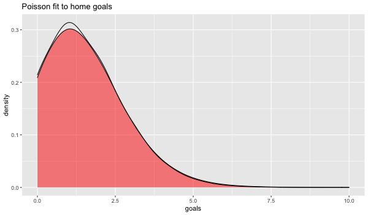
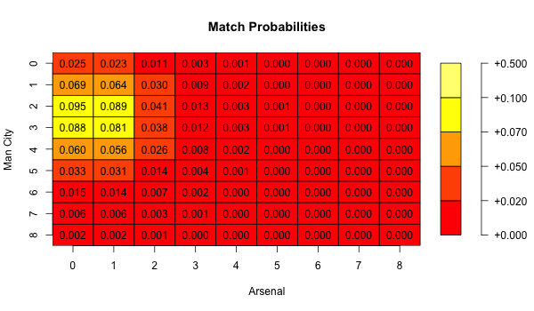

```{r setup, include=FALSE}
knitr::opts_chunk$set(echo = TRUE)
```


```{r, echo=FALSE, warning=FALSE, message=FALSE}
library(ggplot2)
library(reshape2)
require(RColorBrewer)
library(grid)
library(gridExtra)
library(knitr)
```


## Abstract

This article looks at the a basic approach to modelling the outcome of soccer matches in the English Premier League using the Poisson regression. The offensive and defensive abilities of the teams are extracted based on their rate of scoring or conceding goals. Probabilities for  the outcome on each soccer match is then assigned.

## Introduction 
With the ease to information and the increased global audience's willingness to consume sporting activities, there has been a surge in betting across most sporting disciplines. Th English Premier league is one of the most popular sporting activities in the world and many consumers of the league are increasingly wanting to bet on the outcome of matches. It leads to the simple question. Can we use Mathematics to model these outcomes and what are the chances of success?

### Problem Formulation
Soccer, unlike other sports is a low scoring sport. Similarly, there are so many random acts that could influence the outcome of a match. A poor refereeing decision, an injury to a key player, dressing room issues or a lucky deflection on a shot. Despite all these randomness and unpredictability, the key principles usually remain the same. A good team probably scores more and concedes less. Thus, the ability to assess the offensive and defensive ability of a team will be good baseline approach to solving this problem.
To win a football match, you need to score more goals than your opponent. The underlying assumption is goals can be scored at any time and is independent of time. Goals are also discrete events and thus a discrete probability distribution will be a good baseline approach[@groll2015prediction]. A plot of goals scored in the Premier league over 12 year league seasons is shown in Figure 1. As many have pointed in numerous literatures [@dixon1997modelling], the Poisson distribution is a good baseline approach. Figure 2 shows a statistical fit to home goals scored on a given Poisson distribution rate (lambda). It fits home goals scored reasonably well and  similar results would be attained for away goals scored. Now that we have a baseline Probability distribution to work with, we need to determine the appropriate covariates needed to build this model. There are two main soccer modelling decisions: predicting the probability of the outcome of a game (home/away/draw) or predicting the exact scoreline and subsequently forecasting an entire season of soccer matches. For this work, we will predict the probabilities of the outcome of a match.


```{r, echo=FALSE, fig.cap=" Frequency of goals scored in the Premier League "}

```
```{r, echo=FALSE, fig.cap=" Poisson fit to goals "}

```

### Modelling
To predict the probabilities of an outcome on a game, you need to know the probability of a team scoring a certain amount of goals in a game. For a team to score a goal, it depends mainly on the offensive abilities of the team and the defensive abilities of the opponent. Given teams playing at home win more matches in comparison to their away games, it's reasonable to assign a home advantage weighting as well [@forrest2005odds]. Thus, if Team X plays against Team Y at home, we can the number of goals Team X cab score and similarly the number of goals Team Y can also score. We establish the following relationship:

\begin{equation}
P(X=x) = \frac{\lambda_{1}^{x} e^{-x}}{x!}
\end{equation}

\begin{equation}
P(Y=y) = \frac{\lambda_{2}^{y} e^{-y}}{y!}
\end{equation}

where :

$P(X=x)$ is the probability that Team X will score $x$ number of goals against Team Y and $P(Y=y)$ is the probability that Team Y will score $y$ number of goals against Team X


To find the parameters $\lambda _{1}$ and $\lambda _{2}$ We run a poisson regression to generate the parameters for each team and each game :

$$\begin{aligned}
log(\lambda _{1}) &= (attack X) + (defence Y) + (home advantage) \\
log(\lambda _{2}) &= (attack Y) + (defence X)
\end{aligned}$$


### Results
Once we have found the parameters and using the assumption that goals scored are independent, we can find the joint probability distribution as follows :

\begin{equation}
P(X=x, Y=y) = P(X=x)P(Y=y)
\end{equation}

Thus, for a given match, to find the probability that Team X scores 2 goals and Team Y scoers 1 goal is as follows:

\begin{equation}
P(X=2, Y=1) = P(X=2)P(Y=1)
\end{equation}

For our case study from the data, we will use the Man City vs Arsenal game. The diagonal entries in the matrix shows the probabilities that the game ended in a draw, the upper triangular matrix shos the entries where the away team won, whiles the lower triangular matrix shows the entries where the home team won


```{r, echo=FALSE}

```


## Conclusion
This is a very good baseline model. The obvious question to ask? Can we start betting and actually win monies from this? Unfortunately, NO! Well, there is a possibility but not that big. For starters, the model runs under the assumption that the rate of goals scored ($\lambda$) is invariant of time. That is not entirely accurate and others have extended that framework to using bivariate Poisson distribution[@mchale2007modelling]. Again, what will be an appropriate time weighting on matches? Matches played a long time shouldn't carry as much weighting or importance as matches recently played. Other approaches to modelling prediction of soccer has been explored[@owramipur2013football]


## References 

